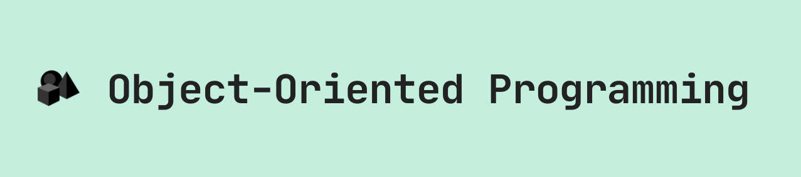

    

> 📚 A repo for practicing Object-Oriented Concepts. The repo includes Object-Oriented projects in different programming languages.

## 📚 Table of Contents

- [Object-Oriented in C++](https://github.com/AhmedSomaa/Object-Oriented-Programming/tree/master/c-plus-plus)

- [Object-Oriented in Java](https://github.com/AhmedSomaa/Object-Oriented-Programming/tree/master/java)

- [Object-Oriented in Python](https://github.com/AhmedSomaa/Object-Oriented-Programming/tree/master/python)

