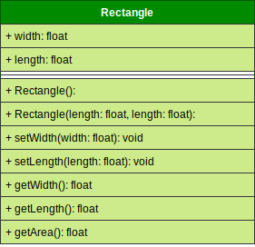

# Project 1

> ⬛ A Simple C++ Object-Oriented project that implements a Rectangle Class. 
>The class attributes and behaviours are presented in the class UML diagram.

`Class UML Diagram`

---

## Learn In This Project

>   A class is a construct that defines a collection of __properties__ and __methods__ in a single unit, which does not __change__ during the execution of a program. Objects are created and eventually __destroyed__ during the execution of a program, so they only live in the program for a short time. While objects are "living" their attributes may also be changed at execution of a program.
>
>   Every object belongs to a class and every class contains one or more related objects. That means, a Class is created once and Object is created from the same Class many time as they require. There is no memory space allocation for a Class when it is created, while memory space is allocated for an Object when it is created.

`💡 Class`
    
- is a user-defined data type, which holds its own data members and member functions, which can be accessed and used by creating an _instance_ of that class (_Object_).

- is a _blue-print_ for an Object.

`💡 Object`

- is an identifiable entity with some _characteristics_ and _behaviour_. 

- is an instance of a Class. When a class is defined, no memory is allocated but when it is instantiated (i.e. an object is created) memory is allocated.

> 📃 Classes are like ideas. Objects are concrete manifestation of those ideas.

`Examples`

- A good example for a class would be a __car__.
> All cars have bodies, engines...etc. 
>
> Those could be the __attributes__.
>
> All cars move, so we could add a method (__behaviour__) to our class.
>
> The idea you really want to enforce in your own mind is that the __template__ of a CAR does not change.

- Example objects for the car class would be __Ford__, __Toyota__...etc.
> Each Object was built from the same set of __template__ (Class) and therefore contains the same components. All Objects share the __same__ copy of the __member functions__ (methods), but maintain a __separate__ copy of the __member data__ (Properties).
>
> For example: A Ford car and a Toyota car are both Cars, so they can be classified as belonging to the Car class. All have same movement (methods) but different in models (properties).

---
## 🔖 Material

- [Difference Between Class & Object.](http://net-informations.com/faq/oops/classobject.htm)