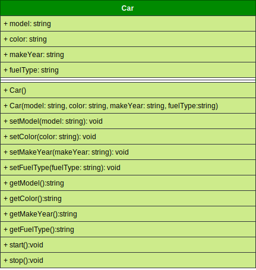

# Project 2

> 🚘 A Simple C++ Object-Oriented project that implements a Car Class. The class attributes and behaviors are presented in the class UML diagram.

`Class UML Diagram`

___

## Learn in This Project

> Classes have special methods called __constructors__.

`💡 Constructor`

- A __constructor__ is a _method_ that is _automatically_ called when an object is created.

- Constructors typically initialize an object attributes and perform other object initialization tasks.

- Constructors are used to perform operations at the time an object is created.

> Constructors have a few special properties that set them apart from normal methods.

- They have the same name as the class.

- The have no return type (not even _void_).

- They may not return any values.

- They are typically _public_.