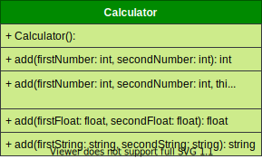

# Project 3

> 🖩 A Simple C++ Object-Oriented project that implements a Calculator Class. The class attributes and behaviors are presented in the class UML diagram.

`Class UML Diagram`

---
## Learn in This Project

`💡 Method Overloading`

- __Method Overloading__ allows a class to define multiple methods with the same name as long as their _signatures_ are _different_.

- __Method Signature__ is (Number of Args, types of Args, order of Args).

- __Method Overloading__ is important because sometimes you need several different ways to perform the same operation. For example, in a calculator addition, you can add integers, floats, strings...etc. In addition, you can add two numbers , three or N numbers. So you would have an _add_ method and overloads it with different signatures to do whatever you want.

---
## 🔖 Material

- [Function Overloading in C++.](https://www.geeksforgeeks.org/function-overloading-c/)